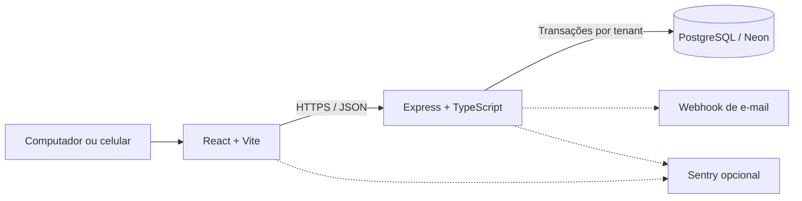

<div align="center">
  
  <h1>CaixaFácil</h1>
  <p><strong>Gestão de caixa, vendas e negócios em uma experiência simples e responsiva.</strong></p>
  <p>
    <a href="https://github.com/thalles-j/caixafacil/actions/workflows/ci.yml"></a>
    
    
    
    
  </p>
</div>

O CaixaFácil é uma aplicação full-stack para pequenos negócios controlarem a
operação diária em um só lugar. O sistema reúne frente de caixa, catálogo,
estoque, clientes, fiado, despesas, fechamentos e relatórios. Uma conta pode
administrar até três negócios independentes e acompanhar os resultados de forma
individual ou consolidada.

O projeto funciona em computadores e celulares, possui perfis de proprietário e
operador, suporta vendas temporariamente sem internet e mantém o isolamento dos
dados de cada estabelecimento no backend e no PostgreSQL.

## Principais recursos

| Área | Recursos |
| --- | --- |
| **Frente de caixa** | Vendas à vista e fiado, abertura e fechamento, entradas, saídas, gorjetas, baixa de estoque e correção de fechamento |
| **PDV físico** | Cupom não fiscal em 58/80 mm, impressão ESC/POS por Web Serial, fallback HTML/PDF e pulso de gaveta |
| **Operação offline** | Fila local em IndexedDB, sincronização idempotente e isolamento por negócio e operador |
| **Multi-negócio** | Até três estabelecimentos por proprietário, troca de contexto e visão financeira consolidada |
| **Catálogo e clientes** | Produtos, serviços, categorias, código de barras, estoque, paginação e histórico de clientes |
| **Financeiro** | Fiado, recebimentos, despesas fixas, movimentações, relatórios por período e histórico de caixa |
| **Equipe** | Contas de operador vinculadas a um único negócio e permissões limitadas à rotina do caixa |
| **Privacidade** | Consentimento versionado para cobrança por WhatsApp e anonimização de dados pessoais |
| **Administração** | Painel separado para contas da plataforma, suspensão, redefinição de senha e auditoria |
| **Operação** | Health check com banco, logs correlacionados, integração opcional com Sentry e monitor de disponibilidade |

## Perfis de acesso

- **OWNER:** administra seus negócios, operadores, configurações, relatórios,
  backups e dados da conta.
- **OPERATOR:** acessa catálogo, clientes, caixa e vendas do estabelecimento ao
  qual está vinculado. Não acessa relatórios consolidados, backups ou gestão da
  conta.
- **ADMIN:** gerencia metadados e estatísticas agregadas das contas da
  plataforma, sem acesso às transações individuais dos estabelecimentos.

## Arquitetura



O repositório é um monorepo npm com dois workspaces:

- `frontend/`: React 19, TypeScript, Vite, Tailwind CSS e React Router;
- `backend/`: Express, TypeScript, Prisma, PostgreSQL, JWT e bcrypt;
- `docs/`: auditoria técnica e roteiros de PDV, privacidade e observabilidade.

A API mantém o access token em memória e o refresh token em cookie HTTP-only.
Toda requisição autenticada revalida o vínculo do usuário com o negócio ativo.
As consultas usam transações por tenant e políticas RLS forçadas no banco.

## Executando localmente

### Requisitos

- [Node.js 22](https://nodejs.org/)
- npm
- banco PostgreSQL; o projeto está preparado para o [Neon](https://neon.tech/)

### 1. Instale as dependências

```bash
git clone https://github.com/thalles-j/caixafacil.git
cd caixafacil
npm ci
```

### 2. Configure o ambiente

Copie [`backend/.env.example`](backend/.env.example) para `backend/.env` e
[`frontend/.env.example`](frontend/.env.example) para `frontend/.env`.

No PowerShell:

```powershell
Copy-Item backend/.env.example backend/.env
Copy-Item frontend/.env.example frontend/.env
```

Preencha ao menos `DATABASE_URL`, `JWT_ACCESS_SECRET` e `JWT_REFRESH_SECRET`.
Use segredos longos, aleatórios e diferentes. Em desenvolvimento, o frontend
usa `/api` e o proxy do Vite encaminha as chamadas para a porta `3000`.

### 3. Prepare o banco

```bash
npm run db:schema
npm run db:seed
```

### 4. Inicie a aplicação

```bash
npm run dev
```

- Frontend: <http://localhost:5173>
- API: <http://localhost:3000/api>
- Health check: <http://localhost:3000/api/health>

Também é possível executar somente um workspace com `npm run dev:frontend` ou
`npm run dev:backend`.

## Dados de demonstração

O seed padrão é não destrutivo. Para recriar apenas as contas de demonstração e
preservar os demais usuários do banco:

```bash
npm run db:seed -- --refresh-demo
```

Cada proprietário recebe três negócios completos. A massa inclui produtos e
serviços, clientes, operadores, vendas históricas, caixas abertos e encerrados,
fiados, despesas, consentimentos e eventos de auditoria. Ela permite demonstrar
filtros, paginação, relatórios e consolidação entre negócios.

<details>
<summary><strong>Credenciais locais de demonstração</strong></summary>

| Perfil | E-mail | Senha |
| --- | --- | --- |
| Proprietário | `thalles@gmail.com` | `Teste123@` |
| Proprietário | `gustavo@gmail.com` | `Teste123@` |
| Proprietário | `marco@gmail.com` | `Teste123@` |
| Administrador | `thalles@admin.com` | `Admin123@` |
| Administrador | `gustavo@admin.com` | `Admin123@` |
| Administrador | `marco@admin.com` | `Admin123@` |

Os operadores usam a senha `Operador123@` e endereços no formato
`operador.<negócio>.<nome>@gmail.com`. Exemplo:
`operador.cafeteria.thalles@gmail.com`.

Essas credenciais são exclusivas da massa de demonstração. Não as utilize em
produção.

</details>

Para apagar todo o conteúdo do banco configurado e recriar a massa:

```bash
npm run db:seed -- --reset
```

Esse comando é destrutivo e deve ser usado somente em um banco de
desenvolvimento ou demonstração.

## Comandos úteis

| Comando | Finalidade |
| --- | --- |
| `npm run dev` | Inicia frontend e backend |
| `npm run build` | Gera os builds de produção |
| `npm run lint` | Valida TypeScript e ESLint |
| `npm test` | Executa os testes automatizados |
| `npm run db:schema` | Aplica as migrations SQL |
| `npm run db:seed` | Cria ou atualiza os dados de demonstração |
| `npm run prisma:validate --workspace backend` | Valida o schema Prisma |

O CI executa instalação limpa, validação do Prisma, lint, build e testes em cada
push para `main` e em pull requests.

## Segurança e privacidade

- Senhas são armazenadas com hash e sessões persistentes podem ser revogadas.
- Rotas sensíveis têm limite de requisições, respostas de autenticação sem cache
  e cabeçalhos de segurança.
- IDs fornecidos pelo cliente não definem diretamente o tenant da conexão.
- Chaves estrangeiras compostas e RLS ajudam a impedir referências entre
  negócios.
- Logs e eventos de observabilidade usam campos permitidos e excluem corpos,
  cookies, tokens, e-mails, telefones e mensagens.
- Backups lógicos pertencem ao negócio ativo e são validados antes da
  restauração atômica.

Os Termos de Uso e a Política de Privacidade incluídos no projeto são rascunhos
técnicos e precisam de revisão jurídica antes de uma publicação comercial.

## Validação antes do deploy

```bash
npm ci
npm run prisma:validate --workspace backend
npm run lint
npm test
npm run build
```

Para hospedar frontend e API em origens diferentes:

1. publique o backend Node e inicie-o com `npm start --workspace backend`;
2. configure `CORS_ORIGIN` e `FRONTEND_URL` com a URL HTTPS do frontend;
3. configure `REFRESH_COOKIE_SAME_SITE=none`;
4. gere o frontend com `VITE_API_URL=https://sua-api.example/api`;
5. aplique `npm run db:schema` durante o release;
6. confirme `/api/health`, CORS, cookie, recuperação de senha e um ciclo de
   exportação e restauração em uma conta de teste.

Se a plataforma aplicar migrations na inicialização, use
`RUN_DB_MIGRATIONS_ON_STARTUP=true` apenas quando houver uma única instância
responsável por essa etapa.

## Documentação

- [Auditoria técnica atual](docs/AUDITORIA.md)
- [PDV físico e operação offline](docs/PDV.md)
- [Privacidade e LGPD](docs/LGPD.md)
- [Observabilidade e disponibilidade](docs/OBSERVABILIDADE.md)
- [Relatório da central de ajuda](docs/RELATORIO_CENTRAL_DE_AJUDA.md)

## Estrutura do repositório

```text
caixafacil/
├── .github/workflows/   # CI e monitor de disponibilidade
├── backend/
│   ├── prisma/          # Schema, migrations e seed
│   ├── src/             # API, autenticação e regras de negócio
│   └── tests/           # Testes do backend
├── docs/                # Documentação operacional e auditoria
├── frontend/
│   ├── public/          # Ícones e arquivos públicos
│   └── src/             # Páginas, componentes, contextos e bibliotecas
├── package.json         # Scripts e workspaces do monorepo
└── package-lock.json
```

## Suporte

A rota pública `/suporte` funciona antes do login. Usuários autenticados também
encontram o atendimento em **Configurações**. O envio depende de
`EMAIL_WEBHOOK_URL`, `EMAIL_WEBHOOK_TOKEN`, `EMAIL_FROM` e `SUPPORT_EMAIL`; o
frontend pode exibir `VITE_SUPPORT_EMAIL` como alternativa.
